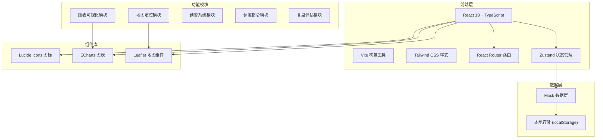

## 1. 架构设计



## 2. 技术选型说明

- **前端框架**：React 18 + TypeScript，提供类型安全和组件化开发能力
- **构建工具**：Vite，快速的冷启动和热更新
- **样式方案**：Tailwind CSS 3，原子化 CSS，快速构建专业 UI
- **路由管理**：React Router DOM v6，单页应用路由
- **状态管理**：Zustand，轻量级状态管理，适合中小型应用
- **图表库**：ECharts 5，功能强大的可视化图表库，支持过程线、雷达图等
- **地图组件**：Leaflet + OpenStreetMap，轻量级开源地图方案
- **图标库**：Lucide React，简洁专业的线性图标

## 3. 路由定义

| 路由路径 | 页面名称 | 说明 |
|----------|----------|------|
| / | 流域总览 | 应用首页，展示全局态势 |
| /rainfall | 雨量站 | 雨量站点监控与数据分析 |
| /river | 河道水位 | 河道水位监测与趋势分析 |
| /reservoir/:id | 单库详情 | 单个水库详细信息与操作 |
| /scheme | 联合调度方案 | 调度方案制定与模拟 |
| /command | 调度指令 | 指令管理与执行跟踪 |
| /review | 复盘评估 | 历史复盘与问题管理 |

## 4. 数据模型定义

### 4.1 核心数据类型

```typescript
// 雨量站
interface RainfallStation {
  id: string;
  name: string;
  lat: number;
  lng: number;
  currentRain: number;
  hourlyRain: number[];
  dailyRain: number;
  threshold: number;
  isAlert: boolean;
  alertLevel: 'normal' | 'warning' | 'danger';
}

// 河道水位站
interface RiverStation {
  id: string;
  name: string;
  lat: number;
  lng: number;
  currentLevel: number;
  warningLevel: number;
  dangerLevel: number;
  trend: 'up' | 'down' | 'stable';
  hourlyLevel: number[];
  updateTime: string;
}

// 水库
interface Reservoir {
  id: string;
  name: string;
  lat: number;
  lng: number;
  currentLevel: number;
  normalLevel: number;
  floodLimitLevel: number;
  maxLevel: number;
  currentStorage: number;
  totalCapacity: number;
  inflow: number;
  outflow: number;
  dischargeCapacity: DischargePoint[];
  storageCurve: StoragePoint[];
}

// 泄流能力点
interface DischargePoint {
  opening: number;
  discharge: number;
}

// 库容曲线点
interface StoragePoint {
  level: number;
  storage: number;
}

// 来水预报
interface Forecast {
  id: string;
  reservoirId: string;
  hours: number;
  inflowData: number[];
  createTime: string;
  creator: string;
}

// 调度方案
interface Scheme {
  id: string;
  name: string;
  createTime: string;
  creator: string;
  status: 'draft' | 'approved' | 'executed';
  reservoirOperations: ReservoirOperation[];
  riskPoints: RiskPoint[];
  simulationResult: SimulationResult;
}

// 水库调度操作
interface ReservoirOperation {
  reservoirId: string;
  reservoirName: string;
  targetLevel: number;
  discharge: number;
  startTime: string;
  endTime: string;
}

// 风险点
interface RiskPoint {
  id: string;
  name: string;
  lat: number;
  lng: number;
  level: 'high' | 'medium' | 'low';
  description: string;
}

// 模拟结果
interface SimulationResult {
  maxLevel: number;
  totalDischarge: number;
  riskLevel: string;
}

// 调度指令
interface Command {
  id: string;
  title: string;
  content: string;
  createTime: string;
  creator: string;
  executor: string;
  status: 'pending' | 'executing' | 'completed' | 'cancelled';
  executeTime?: string;
  completeTime?: string;
  feedback?: string;
  smsSent: boolean;
}

// 调度日志
interface DispatchLog {
  id: string;
  time: string;
  operator: string;
  action: string;
  detail: string;
}

// 历史洪水
interface HistoricalFlood {
  id: string;
  name: string;
  startTime: string;
  endTime: string;
  maxRainfall: number;
  maxLevel: number;
  affectedReservoirs: string[];
}

// 复盘评分
interface ReviewScore {
  id: string;
  floodId: string;
  dimensions: {
    forecastAccuracy: number;
    schemeRationality: number;
    executionTimeliness: number;
    disasterReduction: number;
    collaboration: number;
  };
  totalScore: number;
  reviewer: string;
  reviewTime: string;
}

// 问题清单
interface Issue {
  id: string;
  title: string;
  description: string;
  level: 'critical' | 'major' | 'minor';
  status: 'open' | 'processing' | 'closed';
  assignee: string;
  createTime: string;
  resolveTime?: string;
  resolution?: string;
}

// 值班交接
interface ShiftHandover {
  id: string;
  shiftType: 'day' | 'night';
  handoverTime: string;
  outgoingPerson: string;
  incomingPerson: string;
  keyPoints: string;
  pendingTasks: string;
  remarks: string;
}
```

## 5. 项目目录结构

```
src/
├── components/          # 公共组件
│   ├── Layout/          # 布局组件
│   │   ├── Header.tsx   # 顶部导航
│   │   ├── Sidebar.tsx  # 侧边菜单
│   │   └── index.tsx    # 主布局
│   ├── Map/             # 地图组件
│   │   └── BasinMap.tsx # 流域地图
│   ├── Charts/          # 图表组件
│   │   ├── LineChart.tsx
│   │   ├── RadarChart.tsx
│   │   └── DualAxisChart.tsx
│   ├── Common/          # 通用组件
│   │   ├── DataCard.tsx
│   │   ├── AlertPanel.tsx
│   │   ├── StatusBadge.tsx
│   │   └── Modal.tsx
│   └── Tables/          # 表格组件
│       └── DataTable.tsx
├── pages/               # 页面组件
│   ├── Overview.tsx     # 流域总览
│   ├── Rainfall.tsx     # 雨量站
│   ├── River.tsx        # 河道水位
│   ├── Reservoir.tsx    # 单库详情
│   ├── Scheme.tsx       # 联合调度方案
│   ├── Command.tsx      # 调度指令
│   └── Review.tsx       # 复盘评估
├── store/               # 状态管理
│   └── useAppStore.ts
├── data/                # Mock 数据
│   ├── rainfall.ts
│   ├── river.ts
│   ├── reservoir.ts
│   ├── command.ts
│   └── review.ts
├── types/               # 类型定义
│   └── index.ts
├── utils/               # 工具函数
│   ├── format.ts
│   └── export.ts
├── App.tsx
├── main.tsx
└── index.css
```

## 6. 状态管理设计

使用 Zustand 管理全局状态，主要包括：

- 当前选中的水库/站点
- 预警信息列表
- 调度指令状态
- 用户信息与权限
- 全局筛选条件（时间范围等）

## 7. 性能优化策略

1. 图表数据懒加载，可视区域外图表延迟渲染
2. 地图节点使用 Canvas 渲染，避免大量 DOM 节点
3. 表格虚拟滚动，处理大量数据
4. 组件 memo 优化，避免不必要的重渲染
5. 使用 React Router 的 loader 进行数据预加载
